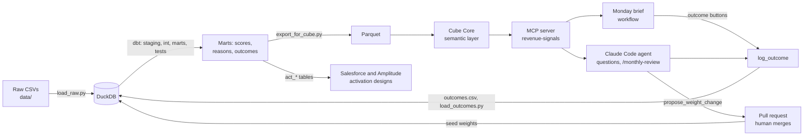

# User Intent Analytics

From raw product events of a CI/CD platform to a tested intent score, a governed semantic layer, an AI agent
that Sales can question, a Monday call brief, and a monthly review that can only change the score through a
pull request a human merges.

Built by Aryan Mohammaddoost on GoalEarn's Analytics Engineer path "User Intent Analytics"
(three linked projects: intent data foundation, PQL identification, revenue activation). The data is a
synthetic, CircleCI-shaped dataset made by GoalEarn for the simulation, included here with their permission.
It is not CircleCI customer data, and the product has no brand name in it.

## The business question

**Which organizations should Sales call this week, why, and how do we learn whether the list was right?**

| Who | Decision | What they get |
|---|---|---|
| Sales rep | Who to call on Monday, who to ask for, how to open | Monday brief: PQAs, contact, reasons, a checked opener, five outcome buttons |
| RevOps | Can we trust the score? | Any metric by name through Cube, the same number everywhere; run scorecards |
| Product | Which orgs need a nudge, not a call? | Boxes synced to Amplitude cohorts (design) |
| Analytics engineer | Are the weights still right? | Monthly review; weight changes only as a pull request, only with enough evidence |

## Architecture



Four rules hold the design together:

1. **The agent orders metrics by name.** It never writes SQL and never opens the database; every number
   comes through Cube, so the brief, the agent and a dashboard can't disagree.
2. **Code decides the steps where the steps are known.** The Monday brief is a workflow: code fetches,
   Claude writes once, code checks every sentence and swaps any that break a rule for a safe template line.
   Open questions go to the agent.
3. **Writes are narrow.** `log_outcome` only appends a row. `propose_weight_change` only opens a branch,
   is refused until 30 real call outcomes exist, and never touches main.
4. **Every run is graded.** A scorecard checks each agent and workflow run: finished, met its goal,
   share of numbers found in tool results, openers rule, run date, label, no invented money.

## What is in it

| Project | Question | Main outputs | Docs |
|---|---|---|---|
| 01 Intent data foundation | Which product behaviors can be trusted as inputs? | 7 staging models, `int_product_events`, `user_intent_events` (10,873 clean events of 12,035), user and org behavior marts, tests | [Reliability report](docs/p01_reliability_report.md) |
| 02 Intent and PQL identification | Which organizations show product-qualified intent? | Weights seed, `fct_user_intent_score`, `fct_org_intent_score`: usage vs buying, four boxes, 13 PQAs of 89 eligible orgs | [Scoring note](docs/intent_score_v0.md) |
| 03 Activation and revenue | How does the list reach Sales and get better over time? | Reason column, Cube semantic layer (5 cubes), MCP server (7 tools), Monday brief workflow, outcomes loop, monthly review, run scorecards, activation tables | [Design brief](docs/p03_design_brief_2026-09-30.md), [Salesforce](docs/activation_salesforce.md), [Amplitude](docs/activation_amplitude.md), [Revenue opportunity](docs/revenue_opportunity.md) |

Results on the run date 31 Aug 2026: 89 eligible organizations, 13 PQAs (5 free, 5 scale, 3 performance),
17 heavy users, 16 tyre kickers, 43 not now. The score is **v0 and unvalidated**: expert weights that no real
outcome has confirmed yet. The product is built to collect the outcomes that will.

## The Revenue Signals tools (MCP)

| Tool | Does | Access |
|---|---|---|
| `list_pqas` | This week's PQAs with contact, ranks and up to three reasons | Read |
| `explain_account` | Why one organization scores where it does, with every signal's points and dates | Read |
| `query_metric` | Any governed metric by name; unknown names are refused with the closest real ones | Read |
| `list_metrics` | The menu of measures and dimensions, with descriptions | Read |
| `review_outcomes` | Meetings by box, by outcome and per signal, plus the evidence gate | Read |
| `log_outcome` | Records what happened on a call (five outcomes; test rows flagged) | Append-only |
| `propose_weight_change` | One weight change on a new branch with a proposal note; pushes it for review | Proposal, human merges |

## Run it (Windows, PowerShell)

Tested with Python 3.12, dbt 2.0.6 (DuckDB built in), Docker Desktop and Claude Code in VS Code.
dbt-core 1.10 or later with dbt-duckdb should also work but was not tested.

```powershell
# 1. Data and models
pip install -r requirements.txt
Copy-Item profiles.example.yml "$env:USERPROFILE\.dbt\profiles.yml"   # or merge it into yours
python load_raw.py                       # raw CSVs from data/ into dev.duckdb, as text
python scripts/load_outcomes.py          # call outcomes log (empty at first) into dev.duckdb
dbt build                                # models and tests

# 2. Semantic layer
python scripts/export_for_cube.py        # marts -> cube/data/*.parquet
Copy-Item .env.example .env              # then set your own CUBEJS_API_SECRET
docker compose up -d                     # Cube Core on http://localhost:4000
python scripts/check_cube.py             # contract check: Cube must match dbt

# 3. Agent tools
python -m venv .venv-mcp
.venv-mcp\Scripts\pip install -r mcp_server/requirements.txt
Copy-Item .mcp.json.example .mcp.json    # then put your own absolute paths in it
# open this folder in VS Code, start Claude Code, type /mcp: revenue-signals should be connected

# 4. Every Monday after that
powershell -ExecutionPolicy Bypass -File scripts\weekly_refresh.ps1
```

`weekly_refresh.ps1` runs, and stops at the first failure: load outcomes, dbt build, export, restart Cube,
both contract checks, the MCP smoke test, then the Monday brief. Scorecards for every run are written to
`runs/index.html` by `scripts/scorecard.py`.

## Repository map

```
data/                  the GoalEarn dataset (synthetic) and its documentation
load_raw.py            loads data/ into DuckDB as raw text (the "L" of ELT)
models/                dbt: staging, intermediate, marts, marts/activation
seeds/                 intent_signal_weights.csv: every weight, readable by Sales and agents
tests/                 singular tests (receipts, reconciliations, sync contracts)
analyses/              evidence queries behind decisions
cube/model/cubes/      the semantic layer: org_scores, user_scores, events, signal_reasons, outcomes
mcp_server/            the Revenue Signals MCP server
scripts/               export, contract checks, smoke test, Monday brief, scorecards, weekly refresh
.claude/skills/        /monthly-review for Claude Code
docs/                  reports, designs and the generated revenue opportunity analysis
```

## Limits, stated plainly

- The score is v0 and unvalidated. No call outcomes exist yet, so the monthly review correctly refuses to
  change any weight.
- No price, revenue or plan-history data exists, so opportunity is sized in accounts and users, not money.
- The data is synthetic; event counts do not track the CI tables (see the reliability report).
- Salesforce and Amplitude are designs with tested sync-ready tables, not live connections.

## How it was built

In pair-programming sessions with Claude (Anthropic): Claude drafted code and documents, Aryan made the
decisions and ran every block on his machine, and every reported number comes from those runs. Commits
carry a Co-Authored-By trailer.

## License

Code: MIT (see LICENSE). The dataset in `data/` belongs to GoalEarn and is included with permission; it is
not covered by the MIT license.
